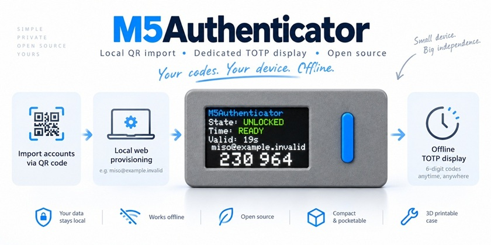

# M5Authenticator

[English](README.md) | **日本語**

M5Authenticatorは、**M5StickS3**で使うスタンドアロンのTOTP認証器です。TOTP認証情報はDevice上の暗号化Vaultに保存し、Vault Master Key（VMK）はUnlock中のみRAMに保持します。Provisioning、アカウント管理、Firmware更新、Recoveryには、ローカル処理を前提としたWebアプリを使用します。

最新安定版の**Desktop Chrome**とWeb Serialで、Hosted Webアプリを利用できます。

**[M5Authenticator Webを開く](https://miso-develop.github.io/m5authenticator/)**

標準TOTP QR画像やGoogle Authenticatorの移行QR画像はブラウザ内でローカルに読み込み、M5StickS3へProvisioningできます。認証時はスマートフォンを操作せず、Device上でアカウントを選択して6桁のOTPを表示できます。

## 主な機能

- RFC 6238 TOTP（SHA-1、6桁、30秒周期）
- 最大32アカウント
- M5StickS3上でのアカウント選択
- Device上での短時間OTP表示
- 標準TOTP QR画像とGoogle Authenticator移行QR画像のローカルImport
- 認証情報を永続化する暗号化Device Vault
- DeviceがUnlock中の間だけRAMに保持するVMK
- Passphraseを毎回再入力せずに使えるTrusted Browser Unlockと、Unlock時のM5StickS3上でのfreshな物理確認
- NTP / PC時刻同期と、OTP表示前のtime readiness gate
- Web UIからのFirmware初回Installとstate-preserving Update
- Browser recovery用の暗号化Recovery Package export/import
- M5Authenticator固有のeFuse provisioningを必要としない設計

## 仕組みとセキュリティモデル

M5Authenticatorは、永続化する暗号化データと、それを復号するための鍵を分離します。

- Device Flashに保存するのは**暗号化Vault**であり、平文のTOTPシークレットではありません。
- **Vault Master Key（VMK）**はDeviceがUnlock中の間だけRAMに保持されます。Lock、再起動、電源断で破棄されます。
- **Trusted Browser**は通常のUnlockを簡単にしますが、M5StickS3上でのfreshな物理確認を省略する仕組みではありません。
- **Recovery Package**は暗号化されていますが、入手した第三者がPassphraseをオフラインで推測できるため、引き続きsecurity-sensitiveなオフライン成果物です。
- Device Factory Resetを行っても、過去に外部へExportしたRecovery Packageは消去・暗号学的revokeされません。
- 通常のNTP時刻は運用上利用しますが、**暗号学的に認証された時刻源ではありません**。
- hardware root of trustや、compromised Trusted Browser/OS、malicious firmware、Unlock中のRAM probing、高度なphysical attackに対する強い耐性は主張しません。

正本となるSecurity contractは[SECURITY.md](SECURITY.md)と[docs/SECRET_VAULT.md](docs/SECRET_VAULT.md)を参照してください。

## はじめ方

1. 最新安定版のDesktop Chromeで[Hosted M5Authenticator Webアプリ](https://miso-develop.github.io/m5authenticator/)を開きます。
2. 新しいDevice、または意図的に初期化したいDeviceにだけ**First install / erase**を使用します。Provisioning済みDeviceでは、対応するユーザー状態を維持する**Update**経路を使用します。
3. Web SerialでM5StickS3へ接続します。
4. 標準TOTP QRまたはGoogle Authenticator移行QRのデータをブラウザ内でローカルにImportします。
5. 選択したアカウントをProvisioningし、Device上で操作を確認します。
6. DeviceがLockされている場合はWebアプリからUnlockし、M5StickS3上でfreshな物理確認を行います。
7. 表示されたOTPを利用する前に、時刻状態がreadyであることを確認します。

Provisionerの詳細動作、アカウント管理、Recovery、Firmware操作は[docs/WEB_PROVISIONER.md](docs/WEB_PROVISIONER.md)と[docs/DISTRIBUTION.md](docs/DISTRIBUTION.md)を参照してください。

## 対応環境

現在のproduction supportは意図的に限定しています。

- **Device:** M5StickS3
- **Browser:** 最新安定版Desktop Chrome
- **Device通信:** Web Serial

他のM5Stack Deviceは、production targetとして明示されていない限り対応済みとはみなしません。

## 利用・Recoveryドキュメント

### 利用 / Web Provisioner

- [Hosted Help / Usage](https://miso-develop.github.io/m5authenticator/help.html) — Deploy済みWebアプリのユーザー向け利用ガイド
- [Web Provisioner](docs/WEB_PROVISIONER.md) — Provisioning、アカウント管理、Browser state、Trusted Browser、Recovery
- [Device UI](docs/DEVICE_UI.md) — アカウント選択、Device確認、時刻状態、OTP表示
- [Time](docs/TIME.md) — 時刻同期とOTP readiness rule
- [Distribution](docs/DISTRIBUTION.md) — Web Flasher、First install、state-preserving Update、Release packaging

### Security / Recovery

- [Security Policy](SECURITY.md) — secret handling要件とthreat-model boundary
- [Third-party notices](THIRD_PARTY_NOTICES.md) — runtime dependencyのライセンス・attribution notice
- [Secret Vault Architecture](docs/SECRET_VAULT.md) — 暗号化Vault、VMK、Passphrase、Trusted Browser、Lock/Unlock、Recovery Package
- [Storage](docs/STORAGE.md) — 暗号化永続化とversioning boundary

### Architecture / Protocol

- [Architecture](docs/ARCHITECTURE.md) — Device/Web/Vaultの責務境界と主要flow
- [Provisioning Protocol](docs/PROVISIONING_PROTOCOL.md) — Web Serial provisioning / unlock protocol
- [V1 Requirements](docs/V1_REQUIREMENTS.md) — cross-feature要件のdurable reference

## 開発・Contributing

FirmwareはESP-IDF/CMake、WebアプリはTypeScript/Viteで構成されています。開発環境、pinned toolchain、再現可能なcommandは[docs/DEVELOPMENT.md](docs/DEVELOPMENT.md)を参照してください。

RepositoryへのContributionとwork trackingのルールは[AGENTS.md](AGENTS.md)と[.agent/WORK-TRACKING.md](.agent/WORK-TRACKING.md)にあります。これらの開発プロセス文書は、上記のProduct利用方法やSecurity contractとは分離されています。

Repositoryへ変更を提出する際は、例やtest materialを必ずsyntheticな値にし、[SECURITY.md](SECURITY.md)に従ってください。
