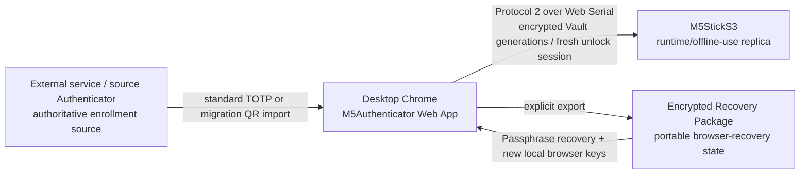
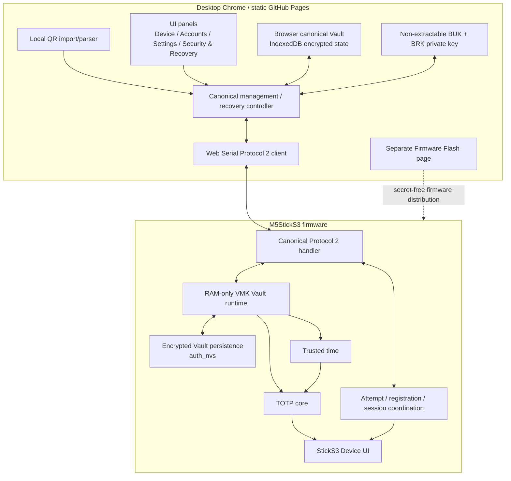
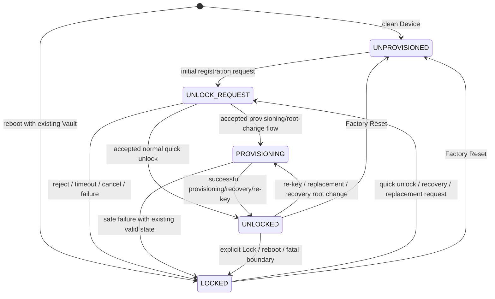
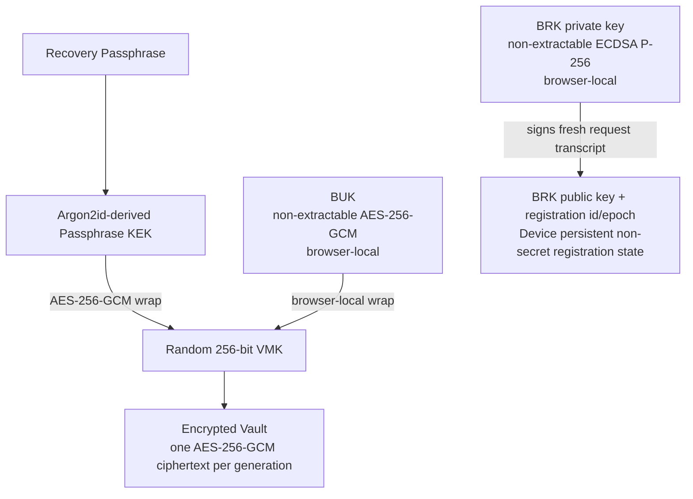
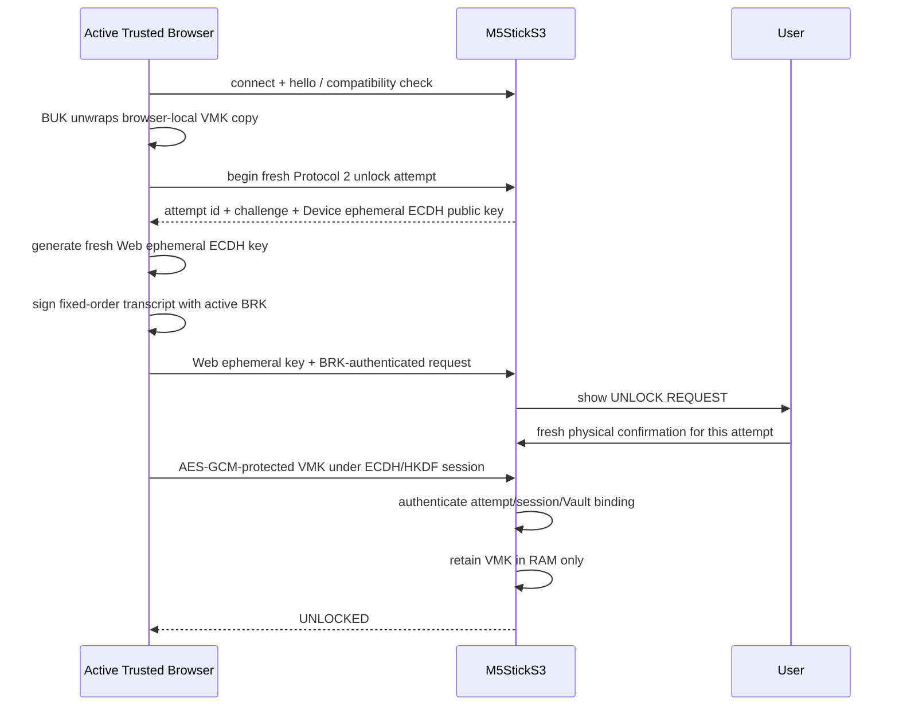
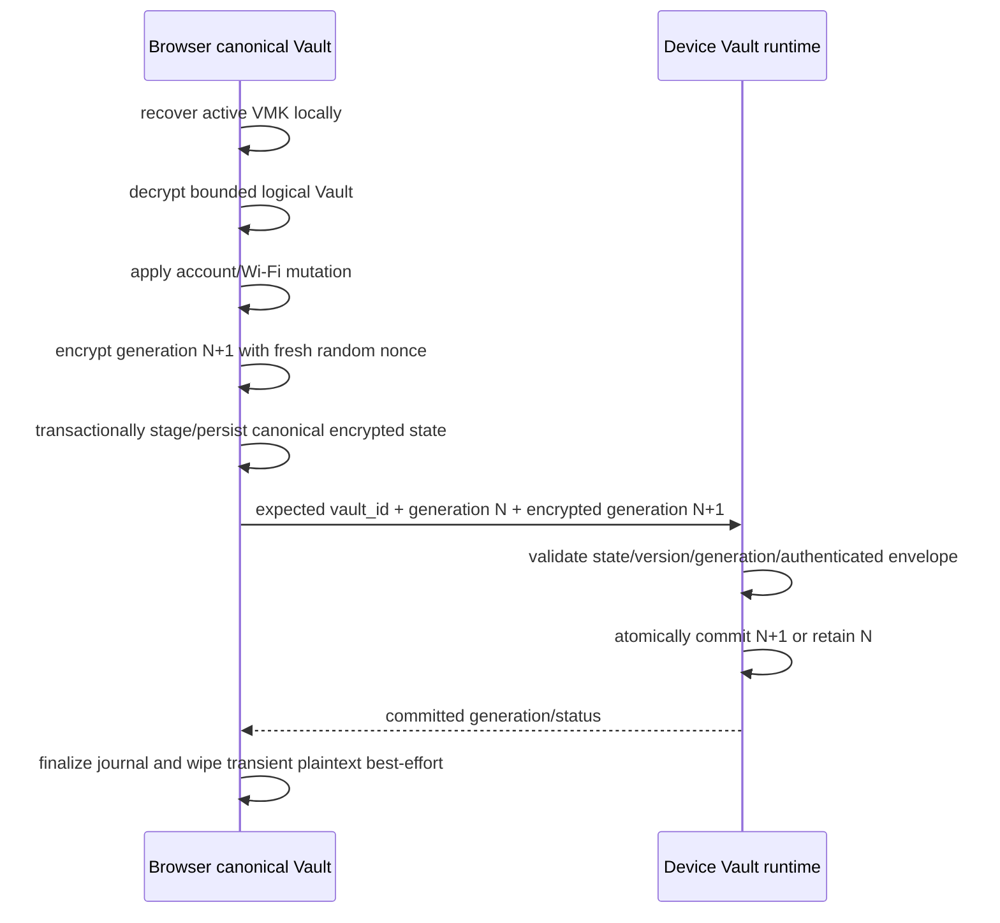

# M5Authenticator V1 Architecture

This document is the durable cross-component architecture reference for M5Authenticator V1. It explains component ownership and end-to-end flows. Focused security/protocol/storage documents remain authoritative for exact cryptographic and persistence rules.

Start with `docs/V1_REQUIREMENTS.md` for the product requirements index. Use `SECURITY.md` for security policy and threat model rather than treating this architecture document as a duplicate policy source.

## System context

M5Authenticator is not the authoritative enrollment source for an external service. It maintains an encrypted replica for convenient offline TOTP use on M5StickS3.



The Web App's Encrypted Vault is the **canonical encrypted replica within M5Authenticator**. The Device copy is the runtime/offline-use replica. Credential replacement after a real compromise still occurs at the external authoritative source.

## Responsibility boundaries

### Firmware core

The platform-independent firmware responsibilities include:

- TOTP algorithm implementation and bounded secret use
- trusted-time state machine and TOTP readiness gate
- Vault format/AAD/AEAD primitives
- VMK wrapping/session cryptographic primitives where Device-side behavior is required
- registration and attempt/session coordination
- protocol state transitions independent of M5StickS3 rendering details

Firmware core must not own browser persistence, Recovery Passphrase entry, QR parsing, or long-lived plaintext account storage.

### Vault runtime and persistence

The Vault runtime owns the Device credential boundary:

- persist authenticated Encrypted Vault generations in `auth_nvs`
- persist only bounded non-secret Vault/registration metadata outside ciphertext
- hold VMK only in RAM while `UNLOCKED`
- transiently open the Vault for bounded TOTP/Wi-Fi/account-display operations
- zeroize VMK/session/plaintext working material at defined destruction boundaries
- perform atomic generation replacement or retain the previous valid generation
- fail closed on incompatible format/generation/state

The runtime does not make generation a hardware-backed anti-rollback primitive.

See `docs/SECRET_VAULT.md` and `docs/STORAGE.md`.

### Device-specific M5StickS3 layer

The StickS3 layer owns hardware interaction and user-visible local behavior:

- `BtnA` account navigation and OTP reveal gestures
- dedicated `UNLOCK REQUEST` physical-confirmation gesture handling
- rendering security/time/account/OTP states without leaking locked Vault metadata
- disabling ordinary account gestures while a security-sensitive confirmation request is active
- clearing visible OTP/account caches on Lock/security transitions

It does not implement an independent plaintext account database or a separate credential-management protocol.

See `docs/DEVICE_UI.md`.

### Provisioning Protocol 2

The Protocol 2 layer owns the Web Serial trust/compatibility boundary:

- versioned bounded NDJSON request/response framing
- `hello` and non-secret status operations
- fresh unlock/registration/recovery/re-key attempts
- Device user-presence coordination
- active BRK request authentication
- ephemeral ECDH/HKDF/AES-GCM VMK delivery
- encrypted Vault generation update and atomic commit coordination
- trusted-time read/mutation state boundaries
- explicit Lock and Factory Reset control
- replay/stale/timeout/cancel/disconnect fail-closed behavior

Protocol 2 has no release operation for exporting stored TOTP secrets, Wi-Fi passwords, VMK, Passphrase-derived material, BUK, or BRK private keys.

See `docs/PROVISIONING_PROTOCOL.md`.

### Web App

The static GitHub Pages Web App owns browser-local canonical management:

- user-initiated Web Serial connection
- standard TOTP QR and Google migration QR decoding/parsing locally
- browser canonical Encrypted Vault persistence in IndexedDB
- transient account/Wi-Fi mutation of decrypted logical Vault state
- Passphrase KDF/VMK wrapping and Recovery Package import/export
- browser-local non-extractable BUK and BRK private key lifecycle
- Trusted Browser quick unlock/replacement orchestration
- encrypted generation synchronization to Device
- generation conflict/recovery handling
- trusted-time sync request UX
- firmware flash/update UX
- explicit destructive Factory Reset UX

The Web App has no server-side credential API. Credential-bearing processing remains in the browser/device path.

See `docs/WEB_PROVISIONER.md`.

## Logical component view



The arrows above describe ownership/data flow, not a permission to export secrets. Credential plaintext is transient at the browser/Vault-runtime boundaries and is never a generic protocol status payload.

## Web information architecture

The current V1 Web App is a static panel-oriented application plus a separate firmware flasher page. The conceptual information architecture is:

| Area | Current panels/operations | Security boundary |
| --- | --- | --- |
| **Firmware Flash** | First install and state-preserving Update on the separate flasher page | Uses secret-free CI-built firmware; normal Update does not erase `auth_nvs` |
| **Device** | Connect, status, Unlock, replacement restore, Lock & Disconnect, refresh, PC time sync | Web Serial open alone does not unlock; quick unlock requires BRK + fresh Device confirmation |
| **Accounts** | Local QR import, canonical account list, rename/reorder/delete, initial provisioning | TOTP secret/account metadata are transient plaintext only while operating on the logical Vault |
| **Settings** | Wi-Fi-for-NTP configuration and approved Device settings | Wi-Fi SSID/password live inside the encrypted Vault and are used only while unlocked |
| **Security & Recovery** | Browser Vault state, Recovery Package export/import, Passphrase change, VMK rotation | Recovery Package omits BUK/BRK private key; re-key/replacement are fresh-confirmation boundaries |
| **Factory Reset** | Explicit destructive normal/recovery reset | Deletes Device/browser paired state in scope; cannot delete external Recovery Packages |

The exact UI may evolve without changing these responsibility boundaries.

## Device state model

User-facing names and protocol tokens are related as follows:

| User-facing state | Protocol/state representation | Meaning |
| --- | --- | --- |
| `UNPROVISIONED` | `unprovisioned` | No usable registered Vault |
| `LOCKED` | `locked` | Vault may exist; VMK absent |
| `UNLOCK REQUEST` | `unlock_pending` | Fresh attempt awaits physical confirmation |
| `PROVISIONING` | `provisioning` | Initial/recovery/replacement/re-key security transition |
| `UNLOCKED` | `unlocked` | VMK present in RAM; credential operations allowed subject to secondary gates |
| `VAULT ERROR` | `error` | Fail-closed invalid/security state |



The diagram is conceptual: exact error/recovery substates fail closed according to focused protocol/runtime documentation.

## Key hierarchy and location



The Device does not persist VMK, Passphrase, KEK, BUK, BRK private key, or session keys. `docs/SECRET_VAULT.md` is the canonical detailed key/persistence reference.

## Fresh Trusted Browser quick unlock

Normal quick unlock avoids Passphrase re-entry while preserving fresh Browser proof and Device user presence.



The attempt expires after 30 seconds. Old button actions, stale challenges/epochs/generations, replay, invalid signature/key, AEAD failure, rejection, cancellation, disconnect, and superseding attempts fail closed.

## Initial provisioning flow

Initial provisioning creates a logical Vault, recovery wrapping, browser trust material, and the first Device encrypted replica without introducing an eFuse security root.

```text
Local QR import or account entry
  -> Browser creates logical Vault using synthetic/user-supplied runtime input only
  -> Browser creates random VMK
  -> Recovery Passphrase -> Argon2id KEK -> wrap VMK
  -> Browser creates non-extractable BUK + BRK
  -> Browser encrypts Vault generation 1 with fresh random nonce
  -> fresh Protocol 2 registration/provisioning attempt
  -> Device shows dedicated physical confirmation request
  -> fresh ECDH/HKDF/AES-GCM session delivers VMK
  -> Device installs BRK public registration metadata
  -> Device atomically persists authenticated Encrypted Vault
  -> Device becomes UNLOCKED
```

No Passphrase/KEK/BUK/BRK private key is sent to or stored on the Device.

## Standard TOTP QR import flow

```text
User selects QR screenshot in browser
  -> browser decodes image locally
  -> parse standard TOTP payload locally
  -> validate supported V1 profile
  -> place account in transient import session
  -> decrypt current canonical Vault transiently when needed
  -> apply import to logical Vault
  -> encrypt new generation with same VMK + fresh random nonce
  -> transactionally persist Browser encrypted generation
  -> synchronize encrypted generation to Device
  -> Device validates expected vault_id/generation and atomically commits
  -> browser clears QR/import/plaintext working state best-effort
```

The QR image/payload is not uploaded or persisted as a credential record outside the encrypted Vault.

## Google Authenticator migration QR flow

Google migration QR import follows the same local-only boundary but may accumulate a migration batch:

```text
one or more migration QR screenshots
  -> decode locally
  -> parse/validate migration batch metadata locally
  -> accumulate transient account previews until batch complete
  -> user applies approved import
  -> one canonical Vault mutation/generation update
  -> encrypted Browser persistence + encrypted Device synchronization
  -> clear migration payload/import session
```

There is no remote migration service, analytics path, or URL carrying the credential payload.

## Canonical Encrypted Vault synchronization

The active Trusted Browser is the normal canonical writer.



When Device is already `UNLOCKED` under the same VMK, this normal update retains the unlocked session and does not ask for physical confirmation per edit. Divergence is not last-writer-wins and enters explicit recovery/reconciliation.

## Browser recovery and Trusted Browser replacement

A Recovery Package restores portable encrypted canonical state; it does not silently authorize a new Browser against an existing Device.

```text
Recovery Package + Recovery Passphrase
  -> validate/version-check package locally
  -> Argon2id KEK unwraps random VMK locally
  -> decrypt/validate Vault locally
  -> create fresh browser-local non-extractable BUK and BRK
  -> store recovered Browser state as replacement-pending
```

If the user is recovering to an existing Device:

```text
replacement-pending Browser
  -> explicit recovery / Trusted Browser replacement attempt
  -> fresh Protocol 2 ECDH/HKDF/AES-GCM session
  -> fresh Device physical confirmation
  -> Device installs new BRK public key + advances registration epoch
  -> old BRK can no longer authorize future quick unlocks
  -> Browser becomes active canonical writer
```

If recovering to a clean replacement Device, the recovered encrypted Vault is explicitly provisioned onto that Device with a fresh Device registration and user confirmation.

Passphrase alone cannot regenerate a lost random VMK. Import alone does not create a silent second active writer.

## Recovery Passphrase change

```text
current canonical state + current Recovery Passphrase
  -> unwrap existing VMK locally
  -> validate new Passphrase policy
  -> derive new Argon2id KEK
  -> re-wrap the same current VMK
  -> update canonical recovery wrapping metadata
```

The Vault does not need re-encryption merely for a normal Passphrase change. Previously exported Recovery Packages are historical independent copies and are not remotely revoked by this operation.

## VMK rotation / re-key

VMK rotation is a recovery-root change and requires fresh Device confirmation.

```text
active canonical Browser + current Recovery Passphrase
  -> decrypt current Vault transiently
  -> generate fresh random VMK
  -> encrypt Vault under new VMK with fresh nonce
  -> update Passphrase-wrapped and BUK-wrapped VMK state
  -> fresh Device re-key attempt + physical confirmation
  -> replace Device VMK/Vault generation atomically
  -> wipe old VMK/session/plaintext material
```

VMK rotation cannot remotely erase an already exported historical Recovery Package.

## USB trusted-time synchronization

`time.status` is non-secret and may be read while locked. `time.sync` mutates the trusted anchor only while unlocked.

```mermaid
sequenceDiagram
    participant B as Browser
    participant D as Device

    B->>D: time.status
    D-->>B: non-secret time state
    alt Device UNLOCKED
      B->>D: time.sync(bounded host Unix timestamp)
      D->>D: set trusted wall clock + current-boot monotonic anchor
      D-->>B: READY/status
    else LOCKED / UNPROVISIONED / UNLOCK REQUEST / PROVISIONING
      B->>D: time.sync(...)
      D-->>B: invalid_state; anchor unchanged
    end
```

An established current-boot anchor may survive explicit Lock, but OTP remains blocked by the independent security-state gate. Reboot/power loss clears the anchor. See `docs/TIME.md`.

## TOTP reveal flow

```text
BtnA hold
  -> verify Device UNLOCKED
  -> verify trusted time READY
  -> use selected opaque credential id to transiently open Vault
  -> locate selected credential
  -> calculate RFC 6238 SHA-1 / 6-digit / 30-second TOTP
  -> wipe secret/decrypted Vault working buffers
  -> render OTP for at most 10 seconds
  -> clear on timeout, Lock, time-state change, selection change, or generation change
```

The Device supports at most 32 accounts. Selection uses manual order, with single click next and double click previous. Account display priority is user display name, then issuer, then account label.

## Factory Reset flow

Factory Reset is an explicit destructive management operation, not a side effect of version mismatch or firmware update.

```text
User explicitly requests Factory Reset in Web App
  -> destructive confirmation UX
  -> Device reset operation / dedicated recovery-reset path as applicable
  -> wipe VMK and pending session material
  -> erase Device Encrypted Vault + M5Authenticator user/settings/registration state
  -> paired browser flow removes matching canonical/Trusted-Browser state
  -> Device returns UNPROVISIONED
```

Factory Reset performs no M5Authenticator-specific eFuse operation. Recovery Packages stored outside the current browser/device remain outside this erase boundary.

## Firmware update flow

The production firmware image is user-independent and secret-free.

```text
CI builds exact merged firmware
  -> release/profile/security-surface validation
  -> same binary used by GitHub Release / Pages Web Flasher / M5Burner

Normal Update in Web Flasher
  -> flash merged image at offset 0x0 with eraseFirst=false
  -> do not overwrite auth_nvs
  -> reboot
  -> Encrypted Vault + registration state remain
  -> RAM-only VMK is gone
  -> provisioned Device starts LOCKED
```

First install is the intentionally destructive path. See `docs/DISTRIBUTION.md` for the exact Flash layout/package contract.

## Trusted-time and lock independence

Security state and time readiness are separate gates:

```text
LOCKED + READY anchor internally present -> OTP blocked
UNLOCKED + NOT SYNCED -> OTP blocked
UNLOCKED + STALE -> OTP blocked
UNLOCKED + READY -> OTP reveal allowed
```

An explicit Lock destroys VMK/session/account plaintext state but may leave the non-secret current-boot trusted-time anchor. Reboot/power loss clears both VMK and trusted-time readiness.

## Version/compatibility boundary

The production architecture is exactly:

```text
Protocol 2
Storage Schema 2
Vault Format 1
security profile encrypted-vault-ram-only-vmk v1
```

These boundaries are independent from firmware SemVer. Compatibility logic must never infer that a matching firmware version makes incompatible protocol/storage/Vault state safe.

Protocol 1 / Storage Schema 1 are retired development semantics and are not a production fallback. Unknown newer versions fail closed. The release validation/build surface prevents retired plaintext/synthetic-key management paths from being reintroduced as a production credential surface.

## Decision lineage

Decision #40 is the current V1 security root. Decisions #45-#49 refine it:

- #45 — Vault ciphertext/nonce/AAD/private-metadata boundary
- #46 — Recovery Passphrase/Argon2id/Recovery Package contract
- #47 — single active Trusted Browser, BUK/BRK roles, replacement
- #48 — fresh Protocol 2 unlock/session cryptography and user-presence binding
- #49 — trusted-time mutation and current-boot anchor lifetime

Decision #20 / Task #26 / PR #39 describe a superseded HMAC/eFuse-backed production-security approach. They are not current V1 architecture and must not be revived merely because historical source/Issue references remain visible.

## Security and threat-model references

Do not duplicate or weaken repository security policy here. Refer to:

- `SECURITY.md` — mandatory security policy, exposure response, threat model
- `docs/SECRET_VAULT.md` — key hierarchy, persistence boundary, Recovery/Trusted Browser semantics
- `docs/REPOSITORY_SECURITY.md` — repository secret-protection baseline
- `docs/DISTRIBUTION.md` — secret-free release/update boundary

V1 specifically does **not** claim a hardware root of trust, strong protection against a compromised endpoint/Trusted Browser, malicious browser extension/XSS, active fake-device/Evil-Maid firmware, RAM probing while unlocked, hardware-backed anti-rollback, or sophisticated physical extraction.
